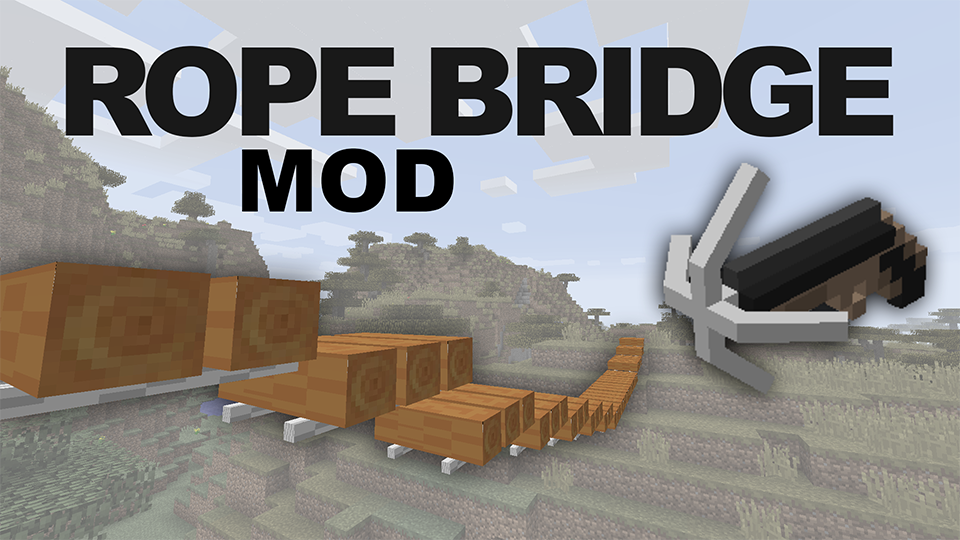
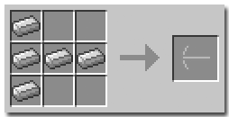
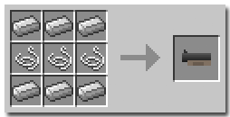
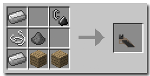
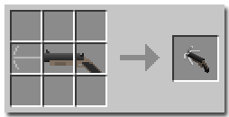
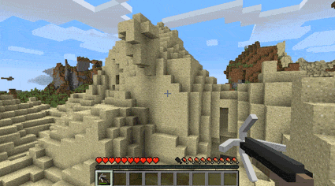
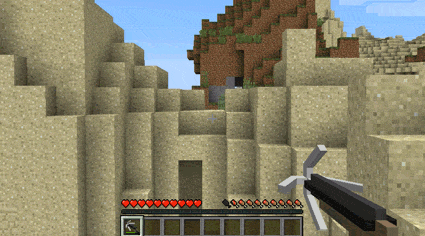
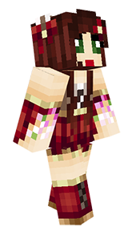
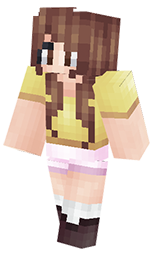

#### The Rope-Bridge mod for Minecraft 1.8.x

[DOWNLOAD v1.1](http://adf.ly/1RrNto)

Jump to:

- [Crafting](#Crafting)
- [Building](#Building)

Rope-Bridge is a mod that builds (you guessed it) rope bridges.
Features:
-   Grappling Gun with three separate craftable parts
-   Simple point-and-shoot system
-   Building animations
-   Detection for blocks that are in the way
-   Custom bridge quarter-slabs
-   Fully server-compatible
-   Custom Acievements!
- 	crafting recipe for string
-   Fancy models (coming to 1.7.10 soon)

---

Reciently updated:
- Ability to break whole bridge while sneaking
- new recipe for string (from wool)
- better bridge length handling
- Grappling gun lasts longer

### Crafting

To craft the grappling gun, three sub-parts must be crafted first:

Hook: 5 iron ingots

Barrel: 6 iron ingots, 3 strings

Stock: 1 flint and steel, 1 gunpowder, 2 iron ingots, 1 string, 2 wood

Now the gun itself can be crafted from the three parts:

---

### Building

To build a bridge, fire the grappling gun just like you would a regular bow. When aiming the grappling gun (right-click), the player's view is zoomed in and directed in line with a cardinal direction.

Upon release the bridge is built if possible.

The bridge won't build if:
- There is something in the way (get's marked with smoke particles)
- The bridge is too steep
- The required materials are not present in the player's inventory

If something goes wrong, a promt will let you know what the problem is and how to fix it. If everything checks out, the bridge will be built from slabs and string found in the inventory.

I hope you enjoy this mod and please don't hesitate to give me ideas for how to improve it. If you wish to use this mod in a video or include it in a pack, just give credit and let me know!

---

Many thanks to Bushi_Seasons and FletcherGirl42 for all their help!

---

### To Do:
- particles on server
- build from player
- Model animation
- Placable bridge walls
- Auto-checker for updates
- updated to 1.8.9
- make use of cofig file
---

# License
GPL V2
